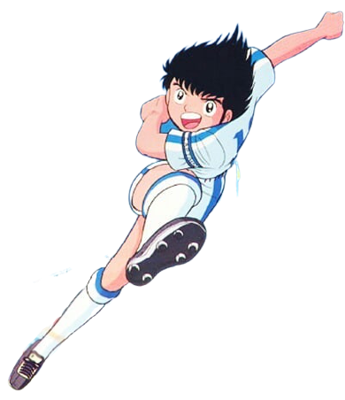

# Hey, I'm Aryan.

<!--  -->

<!--  -->

     
   
    
### 🧐 little more about me :
 
- 📚 &nbsp; just a NERD CpE undergraduate student.
- 📚 &nbsp; try to do my best.

<!-- - 📫 &nbsp; Feel free to ping me on [LinkedIn](https://www.linkedin.com/in//) -->
<!-- - 📝 &nbsp; Checkout my [resume](https://drive.google.com/) -->

